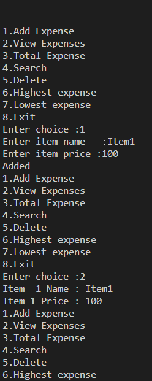

# 💰 Expense Tracker

A Python-based Expense Tracker that helps users record, manage, and analyze their daily expenses through a simple menu-driven interface.

## Features

* Add Expense
* View Expenses
* Calculate Total Expense
* Search Expense
* Delete Expense
* Find Highest Expense
* Find Lowest Expense
* Menu Driven Interface

## Functions

### menu()

Displays the main menu.

### add_expense()

Adds a new expense item and its price.

### view_expense()

Displays all recorded expenses.

### total_expense()

Calculates and displays the total expense amount.

### search_expense()

Searches for an expense by item name.

### delete()

Deletes an expense by item name.

### hig()

Finds and displays the highest expense and its item name.

### low()

Finds and displays the lowest expense and its item name.

### main()

Controls the complete program execution.

## Technologies Used

* Python
* Functions
* Lists
* Loops
* Conditional Statements

## Concepts Used

* CRUD Operations
* Linear Search
* List Manipulation
* Maximum and Minimum Value Search
* Modular Programming

## Sample Output

## Project Structure

Expense-Tracker

├── expenseTracker.py

├── README.md

├── .gitignore

└── Result.PNG

## Version

Current Version: v1.0

## Future Improvements

* Update Expense
* Save Expenses to File
* Load Expenses from File
* Category-wise Expense Tracking
* Monthly Expense Report
* Expense Statistics Dashboard

## Author

Lokesh Sangdoya

B.Tech CSE (AI & ML)
